# HTML - UI パーツ集

## 基本設計

- フレームワーク：Nuxt.js(2.x)
  - pages：TypeScript
  - component：JavaScript
- Linter / Formatter
  - CSS：Stylelint
  - JS：ESLint
  - Formatter：Prettier
- CMS：data/parts.json
- Hosting：Github Pages
- CI/CD：Github Actions

## ページ構成



## 組み込むこと

- stylelint は設定は行う(可能であれば ESLint も)
- デプロイしブラウザで見れるようにする(Github or Gitbucket)

## セットアップ

```bash
# インストール
$ npm install

# ローカルサーバー起動(localhost:3000)
$ npm run dev

# 静的ファイル作成
$ npm run generate
```

## デザインルール

- Atomic Design のエッセンスを導入
- templates はなし(混乱を招く原因)

## 参考サイト

- [動く Web デザインアイデア帳](https://coco-factory.jp/ugokuweb/)
